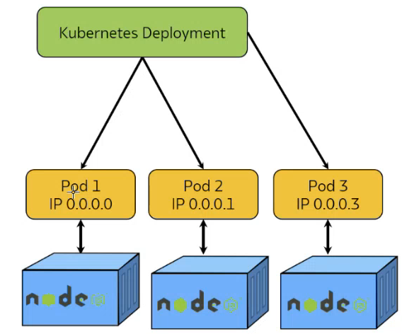
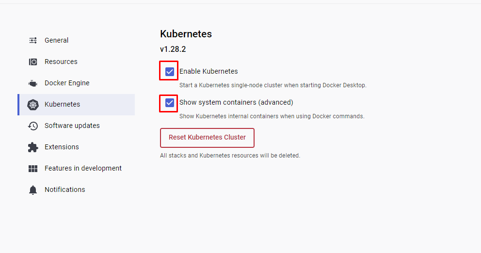

# Kubernetes

## What is Kubernetes?

1. Open-source container orchestration platform.
2. Used for automating deployment, scaling, management of containers.

## Why use Kubernetes:

1. Container Orchestration
   1. Abstracts infrastrucutre, handles the compute, networking, and automates application management.
2. Scaling and Load Balancing
   1. K8 can automatically adjust containers and distribute traffic accordingly.
3. Self-Healing
   1. K8 
4. Portability
   1. K8 abstracts away the underlying infrastructure, making it easier to move your applications between different cloud providers or on-premises data centers without significant modifications.
5. Configurability
   1. K8 allows you to define your application's configuration separately from the code, making it easier to manage and update settings without changing the application itself.
6. DevOps and CI/CD Integration
   1. K8 can be integrated with CI/CD platform.

## Why not to use Kubernetes:

1. Complexity
   1. K8 architecture can quickly become complex and hard to understand.
2. Resource Intensive
3. Application Size
   1. For a small team, K8 could cause more trouble than it's worth.



## Installing K8 on Docker:

1. Navigate to Docker settings:



2. Check the installation:

```
kubectl
```

## Docker Commands:

### Checking K8 

```
kubectl get service
```

OR

```
kubectl get svc
```

### Editing K8 Services

```
kubectl edit deploy nginx-deployment
```