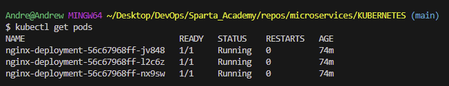
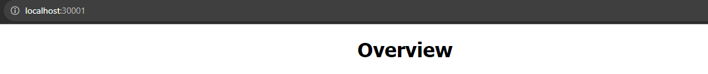

# Setting up a K8 web page

## Step 1:

Create a YAML deployment file:

```
apiVersion: apps/v1
kind: Deployment

metadata:
  name: nginx-deployment
spec:
  selector:
    matchLabels:
      app: nginx
  replicas: 3

  template:
    metadata:
      labels:
        app: nginx
    
    spec:
      containers:
      - name: nginx
        image: jka2023/nginx-254:latest
        ports:
        - containerPort: 80
```

## Step 2:

1. Create application:

```
kubectl create -f nginx-deploy.yml
```

Make sure to be in the same directory, or else you'll have to put the file path.

2. Verify that the pods are running:


```
kubectl get pods
```



## Step 3:

1. Expose the Application via a service yml file:

```
apiVersion: v1
kind: Service
metadata:
  name: nginx-service
spec:
  selector:
    app: nginx
  ports:
    - protocol: TCP
      port: 80
      nodePort: 30001
  type: NodePort
```

2. Create this file:

```
kubectl create -f nginx-service.yml
```

You can now check your webpage on your specified port:

