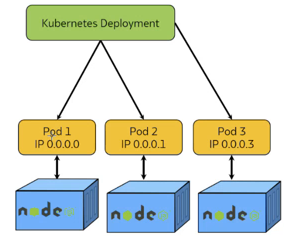

# Kubernetes

## What is Kubernetes?

1. Open-source container orchestration platform.
2. Used for automating deployment, scaling, management of containers.

## Why use Kubernetes:

1. Container Orchestration
2. Scaling and Load Balancing
3. High Availability
4. Resource Efficiency
5. Portability
6. Configurability
7. DevOps and CI/CD Integration

## Why not to use Kubernetes:

1. Complexity
2. Resource Intensive
3. Deployment Time
4. Application Size

