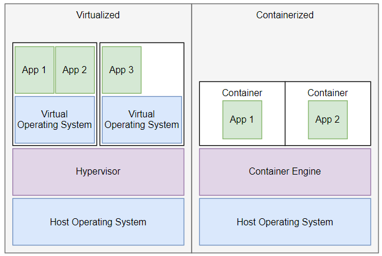

# Virtualization vs Containerization:

Virtualization and containerization are both technologies used to manage and deploy applications and services, but they have distinct differences in how they achieve isolation and manage resources.

## Virtualization:

1. Virtualization runs on a Hypervisor - enables the virtualization of computer hardware, allowing multiple operating systems (OS) to run on a single physical host machine.
2. Every virtual machine within a virtualization system runs a complete operating system instance, which can be different from the host OS. This results in stronger isolation but also consumes more resources due to multiple OS instances.

## Containerization:

1. Containers use the same host machines OS kernal, but isolate a processes file systems.

## Diagram

## Use cases:

1. Virtualization is useful in running multiple operating systems on a single server, and creating sandboxed environments for testing and development.
2. Containerization is for microservices architectures. Containers are particularly useful when you want to package, deploy, and manage applications consistently across different environments.
3. Virtualization is much "heavier" than Containerization. Virtualization gives each machine a more hermetically sealed environment in which no processes can interfere with your application, or vice versa. However, it's not very portable, and not always practical to set up and boot up an entire operating system to deploy an application.